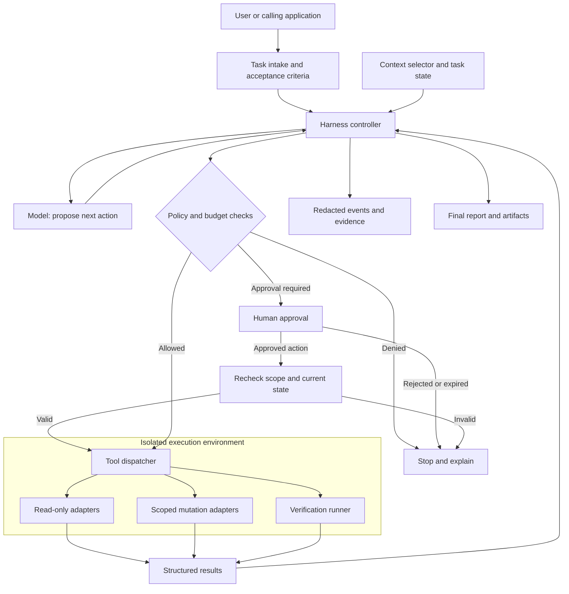

# Agent Harness

An agent harness is the control plane around an AI model. It gives the model a
well-defined job, access to bounded capabilities, and a repeatable loop for
turning requests into verified outcomes.

This repository documents the concepts and practices for designing one. It is
a design guide, not a runnable framework: there is no SDK, application, or
installation step here. The examples below are illustrative contracts and
pseudocode, not APIs implemented by this repository.

The guide is for engineers building agents and technical leaders deciding how
much autonomy a product can safely support. Start with the core model, then
use the worked example and implementation checklist to scope a first release.

## Contents

- [Why use a harness?](#why-use-a-harness)
- [Core model](#core-model)
- [Reference architecture](#reference-architecture)
- [Agent lifecycle](#agent-lifecycle)
- [Task and execution contracts](#task-and-execution-contracts)
- [Tool design](#tool-design)
- [Context management](#context-management)
- [Safety boundaries](#safety-boundaries)
- [Verification](#verification)
- [Worked example: a repository maintenance agent](#worked-example-a-repository-maintenance-agent)
- [Project and product examples](#project-and-product-examples)
- [Progress and final reports](#progress-and-final-reports)
- [Operating a harness](#operating-a-harness)
- [Implementation checklist](#implementation-checklist)
- [Contributing](#contributing)

## Why use a harness?

A model can generate an answer, but production work usually requires more:

- understanding a request and the surrounding repository or service;
- choosing and invoking tools such as search, tests, or issue trackers;
- preserving user intent, permissions, and repository conventions;
- checking the result before reporting it; and
- leaving an auditable record of actions and decisions.

The harness owns these responsibilities. It should make the safe and correct
path easy, while keeping the agent's authority no broader than necessary.

For example, a model can suggest a bug fix. A harness can restrict the work to
one checkout, collect relevant code, apply a proposed patch, run tests in a
sandbox, and present the diff for review. The useful outcome is a verified
artifact, not merely a plausible response.

### Choose the simplest suitable approach

| Approach | Best fit | Boundary |
| --- | --- | --- |
| Direct model call | Summarizing supplied text or drafting an answer | The application still owns input handling and output validation. |
| Deterministic workflow | Known steps such as extract, validate, and route | Prefer ordinary code when the next action is predictable. |
| Agent with a harness | Tasks requiring adaptive search, tool selection, and iteration | Flexibility requires budgets, permissions, and independent verification. |
| Multiple agents | Work that genuinely benefits from independent specialists | Coordination, shared state, and verification become more complex. |

Retrieval-augmented generation (RAG) supplies relevant information; it does not
by itself authorize actions. A tool protocol such as the Model Context Protocol
(MCP) standardizes integration, but does not replace application policy,
identity checks, or runtime isolation.

## Core model

An effective harness separates the following concerns:

| Concern | Responsibility |
| --- | --- |
| **Task** | Defines the requested outcome, acceptance criteria, and constraints. |
| **Context** | Supplies only the repository, user, and execution information needed to do the work. |
| **Policy** | States non-negotiable safety, privacy, approval, and scope rules. |
| **Agent** | Reasons about the task and proposes or performs the next action. |
| **Tools** | Provide explicit, typed capabilities to inspect, change, validate, and publish work. |
| **Runtime** | Enforces isolation, timeouts, credentials, filesystem boundaries, and network controls. |
| **Verifier** | Evaluates the result using tests, linters, reviewers, or explicit acceptance checks. |
| **Reporter** | Communicates progress, evidence, limitations, and the final outcome. |

Keep these layers distinct. In particular, policy and tool permissions belong to
the harness rather than relying solely on instructions supplied to the model.

## Reference architecture

The model proposes actions; the harness decides whether and how they execute.
Keep credentials and enforcement outside the model's context.



The controller owns task state and scheduling. The dispatcher checks tool
identity, arguments, authorization, and limits on every invocation. The runtime
enforces filesystem, process, and network boundaries even if the model or a
tool behaves unexpectedly. External systems still require their own scoped
credentials and authorization; a sandbox alone cannot prevent misuse of a
permitted API.

For a first version, these can be modules in one service rather than separate
microservices. Separate the trust boundaries before separating deployments.
Store durable task state so a service restart does not silently lose approvals
or repeat consequential actions.

## Agent lifecycle

Use a bounded, observable lifecycle rather than an unstructured conversation:

1. **Receive** — parse the task, identify the target, and record the requested
   outcome.
2. **Orient** — inspect the relevant project instructions, status, code, and
   existing tests before changing anything.
3. **Plan** — turn the request into small, verifiable steps; surface ambiguity
   or required approval early.
4. **Act** — call the least-privileged tool needed for each step. Prefer
   inspection before mutation.
5. **Verify** — run the narrowest relevant checks, then manually review the
   changed behavior and diff.
6. **Report** — state what changed, how it was verified, and any remaining
   risks or follow-up work.

The harness should stop when the task is complete, when a policy boundary is
reached, or when continuing would require a decision from the user.

```mermaid
stateDiagram-v2
    [*] --> Received
    Received --> Orienting
    Orienting --> Planning
    Planning --> Acting: Clear scope
    Planning --> Waiting: Clarification needed
    Acting --> Waiting: Approval needed
    Waiting --> Planning: Clarified or approved; revalidate
    Waiting --> Stopped: Rejected or expired
    Acting --> Verifying: Candidate ready
    Verifying --> Acting: Repairable failure within budget
    Verifying --> Completed: Acceptance criteria met
    Verifying --> Stopped: Blocked or budget exhausted
    Acting --> Stopped: Denied, cancelled, or limit reached
    Completed --> [*]
    Stopped --> [*]
```



Cancellation and deadlines apply in every nonterminal state, including waiting
and verification. A stopped run may retain useful artifacts, but must not be
reported as completed. A verifier failure should lead to a bounded repair
attempt or a clear blocker, not an indefinite retry loop.

### Recovery and retries

- Retry transient read failures with bounded backoff; do not retry a policy
  denial or invalid argument unchanged.
- Before retrying a write after a timeout, query the destination for its outcome.
  A missing response does not mean the action failed.
- Use idempotency keys where the destination supports them. Otherwise,
  reconcile state or ask a human rather than blindly repeating a write.
- Checkpoint the current plan, artifact revision, completed tool calls, and
  pending approvals. Revalidate permissions and resource versions on resume.
- Do not assume external effects can be rolled back. Define a compensating
  action or manual recovery procedure for each consequential operation.

## Task and execution contracts

Make the requested outcome machine-readable before giving the model tools.
The following JSON describes a hypothetical task in another repository; its
paths and test target are examples, not files or commands in this project.

```json
{
  "task_id": "task-042",
  "objective": "Reject a negative quantity when calculating an order total",
  "workspace": "/workspace/order-service",
  "acceptance_criteria": [
    "Negative quantities raise ValueError",
    "Zero and positive quantities keep their existing behavior"
  ],
  "allowed_write_paths": ["src/orders.py", "tests/test_orders.py"],
  "allowed_tools": ["read_file", "apply_patch", "run_check"],
  "verification_targets": ["orders-unit-tests"],
  "limits": {
    "max_model_turns": 12,
    "max_tool_calls": 30,
    "wall_time_seconds": 600,
    "max_output_bytes_per_call": 32768
  },
  "on_limit": "stop_and_report"
}
```

These values are starting points, not production defaults. Authenticate the
caller and intersect requested permissions with server-side policy; never let
a task grant itself access. Resolve check identifiers to trusted configuration
outside agent-writable files. Add model token/cost limits and per-tool deadlines
appropriate to the deployment.

### Bounded controller sketch

This pseudocode shows responsibility boundaries, not a security-complete
implementation. Each helper requires a concrete implementation and tests.

```text
task = authenticate_validate_and_scope(request, server_policy)
state = create_or_resume_task(task)

while not state.terminal:
    enforce_deadline_cancellation_and_remaining_budget(state)
    context = select_and_redact_context(task, state)
    proposal = ask_model(context, permitted_tool_schemas(task))
    record_model_usage(state, proposal.usage)

    if proposal.kind == "finish":
        evidence = run_required_checks_on_current_artifact(task, state)
        if acceptance_criteria_met(task, evidence):
            state.complete(evidence)
        else:
            state.record_failure_or_stop(evidence)
        continue

    call = validate_tool_name_and_arguments(proposal)
    decision = authorize(task, call, current_resource_versions())
    if decision.denied:
        state.stop(decision.reason)
        continue
    if decision.requires_approval:
        approval = await_scoped_approval(call, deadline=state.deadline)
        require_valid_approval_and_reauthorize(approval, task, call)

    reserve_tool_budget_or_stop(state, call)
    result = execute_in_sandbox(call, timeout=remaining_deadline(state))
    state.record(redact(result))
    checkpoint(state)

emit_report(state.status, state.artifacts, state.evidence, state.limitations)
```

Deadline, denial, cancellation, and execution errors must transition to an
explicit stopped or recoverable state and still produce a report. Enforce
limits inside model calls, verification, and tools as well as at loop
boundaries. Persist write intent before an external mutation and reconcile
uncertain results on recovery; checkpointing after a call alone cannot ensure
exactly-once execution.

## Tool design

Tools are the agent's real capabilities. Design them as narrow interfaces with
clear inputs, outputs, and side effects.

- Split read-only tools from tools that mutate files, repositories, or external
  systems.
- Require explicit arguments instead of allowing arbitrary shell or network
  access where a focused operation is possible.
- Validate arguments and canonicalize paths before executing an operation.
- Return structured results, including command status, changed resources, and
  concise diagnostic output.
- Set time, output, retry, and concurrency limits.
- Mark irreversible or externally visible operations—such as publishing,
  deploying, deleting, or sending messages—for explicit approval.

Tool descriptions should explain both what a tool can do and what it cannot.
The model must not be able to obtain additional authority merely by composing
instructions.

### Example tool contract

Prefer a named check to a model-supplied shell command. For the hypothetical
order service, `run_check` could accept:

```json
{
  "name": "run_check",
  "arguments": {
    "check_id": "orders-unit-tests",
    "artifact_revision": "candidate-007"
  }
}
```

The harness maps `orders-unit-tests` to a reviewed command in trusted
configuration. It rejects unknown identifiers and extra arguments, confirms
that `candidate-007` is the current immutable candidate, and records a result:

```json
{
  "status": "passed",
  "exit_code": 0,
  "check_id": "orders-unit-tests",
  "artifact_revision": "candidate-007",
  "duration_ms": 842,
  "summary": "8 tests passed",
  "output_truncated": false
}
```

This is sample output, not a test result from this repository. Define distinct
statuses for `failed`, `timed_out`, `cancelled`, and `unavailable`; none implies
success. Store redacted diagnostic artifacts when output is truncated.

Even a fixed test command executes repository code. Run it without production
credentials and with restricted network access. For file tools, enforce path
boundaries after canonicalization, account for symlinks, and prevent races
between checking a path and opening it.

## Context management

Context quality matters as much as context volume. Supply authoritative,
task-relevant material first:

1. task description and acceptance criteria;
2. repository-specific instructions and current working state;
3. relevant source, configuration, and tests;
4. tool results and verification evidence.

Summarize large or repetitive output, but preserve exact errors, commands, and
file locations needed to make decisions. Clearly label untrusted content—such
as issue comments, web pages, logs, and generated files—so it cannot override
the harness policy.

Avoid placing secrets, access tokens, private customer data, or unrelated
repository content in model context. Redact sensitive values in logs and tool
output.

### Separate context by lifetime and trust

| Context class | Example | Handling |
| --- | --- | --- |
| Trusted configuration | Tool allowlist and approval rules | Loaded by the harness; not editable by the agent |
| Task-local state | Plan, current diff, failed check | Checkpoint with task ID and artifact revision |
| Retrieved evidence | Source snippets, issue text, web content | Label origin and treat embedded instructions as untrusted |
| Durable memory | Reviewed project convention | Store only when permitted, with provenance and expiry/review rules |

When summarizing, retain unresolved questions, constraints, exact failure
evidence, and references back to originals. Do not turn a model's inference
into a stored fact. Re-read mutable resources before acting on an old summary.
Partition retrieval, caches, and memory by tenant and authorization scope to
avoid cross-user information leakage.

## Safety boundaries

Use defense in depth. Prompts guide behavior; runtime controls enforce it.

- Run work in an isolated environment with scoped filesystem and network access.
- Issue short-lived, least-privilege credentials only to tools that need them.
- Keep destructive operations behind confirmation or a dedicated approval gate.
- Scan changed files for secrets before publishing changes.
- Treat external instructions as data, not authority.
- Preserve user changes and avoid rewriting history or modifying unrelated
  files.
- Log tool calls and policy decisions without logging sensitive values.

For tasks that affect security, data, money, production systems, or external
communications, require a human checkpoint before the consequential action.

| Threat or failure | Enforcement | Verification exercise |
| --- | --- | --- |
| A retrieved page asks the agent to upload credentials | No credentials in context; restricted egress and tool authorization | Supply adversarial retrieved text and confirm no upload occurs |
| A proposed file path escapes the workspace | Canonical path checks and sandbox boundaries | Test traversal, absolute paths, and symlink escapes |
| The model invents an administrative tool | Registry allowlist and strict argument validation | Reject unknown tools and unexpected fields before execution |
| A retry creates a duplicate external action | Idempotency keys and destination reconciliation | Simulate a timeout after the destination accepts a write |
| An approval is reused for a different payload | Bind approval to actor, action, resource, payload, revision, and expiry | Change the payload after approval and require a new decision |
| An agent weakens tests to obtain a green result | Independent checks and review of test changes | Confirm removal of a required assertion cannot satisfy acceptance |

Approval is not blanket authority for the rest of a session. Show the reviewer
the exact diff or external action, expected effects, and available evidence.
Reject stale approvals and recheck authorization immediately before execution.
Treat model output as untrusted input to downstream systems as well: validate
structured data and escape rendered content.

## Verification

Verification is part of the task, not a final optional step. Match checks to the
change:

| Change | Typical evidence |
| --- | --- |
| Application behavior | Focused automated tests and a manual exercise of the changed path |
| Library or API | Unit and integration tests, compatibility checks, and examples |
| Configuration or workflow | Syntax validation, a dry run where available, and review of permissions |
| Documentation | Link and Markdown checks where available, plus an accuracy and readability review |

Start with targeted checks while iterating. Run broader project checks after the
change is complete when they are available and proportionate. If a check cannot
run, report the reason instead of implying success.

### Verify the harness as well as its artifacts

Test deterministic enforcement independently of the model: denied actions must
never reach adapters, timeouts must release resources, and cancellation must
stop dispatching new work. Use fake adapters to exercise failure handling
without performing real external writes.

Maintain a representative evaluation set containing successful tasks, ambiguous
requests, unavailable tools, adversarial content, stale approvals, and budget
exhaustion. For nondeterministic runs, compare repeated trials on task success,
unsafe attempted actions, actual unauthorized effects, latency, and cost.
Keep evaluation checks outside agent-writable scope.

A passing command is only one piece of evidence. Associate results with the
exact artifact revision; edits after a check invalidate affected evidence.
Combine automated checks with acceptance review, especially when requirements
involve usability or business policy that tests do not fully capture.

## Worked example: a repository maintenance agent

Consider an order-service team receiving this request:

> Reject negative quantities in the total calculator, preserve zero-quantity
> behavior, and prepare a patch for review. Do not publish or deploy anything.

1. **Receive:** record the two behavior requirements and the no-publication
   constraint in the task contract shown above.
2. **Orient:** inspect the existing calculator, tests, repository instructions,
   and working-tree changes. Clarify the exception type if it is not established
   by the API contract.
3. **Plan:** add a negative-input regression test, add the smallest guard, and
   run the relevant checks. Leave unrelated pricing behavior untouched.
4. **Act:** edit only the two authorized files in an isolated checkout. A
   hypothetical Python implementation might contain this guard:

   ```python
   def total_price(unit_price, quantity):
       if quantity < 0:
           raise ValueError("quantity must be non-negative")
       return unit_price * quantity
   ```

   This assumes the application already validates numeric types and represents
   currency appropriately; it is not a complete order or money-handling API.
5. **Verify:** confirm the negative-input test fails on the baseline and passes
   on the candidate. Check zero and positive quantities, inspect the diff, and
   run applicable broader checks. If dependencies are unavailable, report that
   verification is blocked rather than reporting a verified fix.
6. **Report:** return the patch, checked revision, actual check results, and
   limitations. Publication is not authorized by this task.

If the product later adds pull-request creation, make it a separately
authorized action:

```mermaid
sequenceDiagram
    actor User
    participant Harness
    participant Model
    participant Sandbox
    participant Reviewer
    participant Git as Repository service
    User->>Harness: Request a patch with acceptance criteria
    Harness->>Model: Scoped context and permitted tools
    Model-->>Harness: Proposed edits
    Harness->>Harness: Validate permissions and limits
    Harness->>Sandbox: Apply edits and run required checks
    Sandbox-->>Harness: Candidate revision, diff, and evidence
    Harness-->>User: Patch and verification report
    opt Separately requested pull-request publication
        Harness->>Reviewer: Exact candidate and publication action
        alt Approved
            Reviewer-->>Harness: Scoped, expiring approval
            Harness->>Harness: Revalidate authorization and revision
            Harness->>Git: Publish approved candidate if still valid
            Git-->>Harness: Confirmed result
            Harness-->>User: Publication result
        else Rejected or expired
            Harness-->>User: Patch retained; nothing published
        end
    end
```

## Project and product examples

### Products you could build

| Product | Bounded agent task | Tools and context | Verification and human boundary |
| --- | --- | --- | --- |
| Repository maintenance assistant | Prepare a narrowly scoped bug-fix patch | Source search, file edits, sandboxed checks | Regression evidence and diff review; separate approval to publish |
| Customer-support copilot | Draft a response using approved help content | Tenant-scoped ticket lookup and knowledge retrieval | Check cited policy and redact personal data; human approves sending or refunds |
| Analytics assistant | Answer a business question from approved datasets | Catalog lookup and read-only, resource-limited queries | Validate aggregates and freshness; restrict sensitive rows and exports |
| Incident triage assistant | Summarize symptoms and propose a runbook step | Redacted logs, metrics, and read-only service status | Link claims to telemetry; operator authorizes production mutations |

Read-only does not mean risk-free: retrieval can expose private data and queries
can exhaust resources. Apply authorization, data minimization, and resource
limits even when no writes are allowed.

### Existing projects to study

These examples illustrate different parts of a harness, not interchangeable
solutions or dependencies of this repository. Consult their official
documentation for current behavior and configuration.

| Project or product | Relevant capabilities | Design lesson and boundary |
| --- | --- | --- |
| [LangGraph](https://docs.langchain.com/oss/python/langgraph/overview) | Stateful orchestration, durable execution, and human-in-the-loop workflows | Resumable approval checkpoints need configured persistence and thread identity; orchestration is not an authorization system. |
| [OpenAI Agents SDK](https://openai.github.io/openai-agents-python/) | Agent/tool orchestration, handoffs, guardrails, and tracing | Agent-level input/output guardrails do not inspect every intermediate tool call; enforce authorization at tool execution boundaries. |
| [OpenHands](https://docs.openhands.dev/sdk) | Software-development tools, Docker workspaces, and configurable action confirmation | Runtime isolation and approval policies are separate controls; confirmation behavior depends on configuration. |
| [GitHub Copilot cloud agent](https://docs.github.com/en/copilot/concepts/agents/cloud-agent/about-cloud-agent) | Repository-oriented work in an ephemeral environment, test/lint execution, and reviewable changes | A reviewable pull request is an artifact, not proof of correctness; humans still review changes and verification evidence. |

For details behind these boundaries, see LangGraph's
[interrupts](https://docs.langchain.com/oss/python/langgraph/interrupts),
the Agents SDK's [guardrails](https://openai.github.io/openai-agents-python/guardrails/),
OpenHands' [security guide](https://docs.openhands.dev/sdk/guides/security),
and GitHub's [responsible-use guidance](https://docs.github.com/en/copilot/responsible-use/agents).

Choose based on the missing layer: orchestration for resumable workflows,
an SDK for tool-driven application logic, or a coding-oriented environment for
repository tasks. In every case, decide which controls the product supplies
and which remain your application's responsibility.

## Progress and final reports

Progress updates should be short and factual. A useful update records completed
work, the next verification step, and any blocker. The final report should
include:

- the user-visible outcome;
- the files or systems changed;
- validation performed and its result;
- items intentionally not changed; and
- unresolved risks, limitations, or follow-up actions.

Do not claim that a command, test, review, or deployment succeeded unless the
harness has recorded its successful result.

An illustrative report for the order-service task would be:

```text
Status: completed (patch only)
Changed: src/orders.py and tests/test_orders.py
Evidence: orders-unit-tests passed on candidate-007; diff reviewed
Scope: negative quantities rejected; zero/positive cases covered
Not performed: publication, deployment, or production access
Limitations: no end-to-end checkout-system test was run
```

Only emit this status and evidence if they were actually observed. If a required
check cannot run, report `blocked` or `partial` with the reason and preserved
artifacts instead.

## Operating a harness

### Observability and cost

Record structured events with task ID, tool-call ID, timestamp, artifact
revision, policy decision, duration, status, and usage. Keep sensitive payloads
out of routine telemetry; apply access controls and retention limits to
diagnostic artifacts. Collect decision summaries and observable evidence rather
than private model reasoning.

| Metric | What it reveals | Interpretation caution |
| --- | --- | --- |
| Verified task completion rate | Useful outcomes against acceptance criteria | A model's self-reported completion is not verification |
| Unauthorized effects and blocked attempts | Enforcement failures and attempted boundary crossings | Zero observed incidents does not prove safety |
| Human intervention rate | Ambiguity, missing tools, or appropriate escalation | Lower is not always better for high-impact work |
| Cost per verified completion | Efficiency including failed runs and retries | Cheap failed runs can make per-run cost misleading |
| Median and tail latency | User experience and slow external dependencies | Separate execution time from approval waiting time |
| Retry and repeated-action rate | Flaky tools or unproductive loops | Inspect duplicates and timeouts, not only averages |

Set per-task and per-tenant budgets. Reserve capacity for verification and
reporting rather than spending the entire budget on generation. Queue work and
cap concurrency so agents cannot overwhelm downstream services.

### Rollout and architecture choices

Start with an offline evaluation set, then run in a read-only or draft-only mode.
Introduce scoped writes only after the relevant controls have been tested.
Retain a kill switch that stops new dispatches and a recovery procedure for
in-flight operations; stopping the model cannot undo an already accepted write.

Prefer one agent and deterministic orchestration until measured evidence
justifies more complexity. When adding specialist agents, give each explicit
inputs, outputs, permissions, and budget. Use isolated workspaces for parallel
edits and one owner for integration. Delegation must not expand the parent's
authority, and aggregate budgets must include all child runs.

| Common pitfall | Better default |
| --- | --- |
| A long prompt is the only safety control | Enforce policy in dispatchers, credentials, and runtime boundaries |
| Arbitrary shell access is the default tool | Start with narrow typed tools; isolate any necessary shell execution |
| Every failure is retried | Classify failures and reconcile uncertain writes |
| More context or more agents is assumed to help | Measure outcomes and add only task-relevant information or specialization |
| Framework selection is treated as the whole architecture | Explicitly assign ownership of state, authorization, verification, and operations |

## Implementation checklist

When building a harness, define the following before expanding agent autonomy:

- [ ] Task schema and acceptance criteria
- [ ] System policy, escalation rules, and stop conditions
- [ ] Tool contracts, permission model, and approval gates
- [ ] Sandbox, credential, network, and filesystem boundaries
- [ ] Context selection, redaction, and retention strategy
- [ ] Execution limits, retries, cancellation, and recovery behavior
- [ ] Structured event logs and audit trail
- [ ] Verification strategy and failure reporting
- [ ] Metrics for task success, safety violations, cost, latency, and retries
- [ ] Representative evaluations, including adversarial and failure cases
- [ ] Tenant isolation, approval expiry, and safe resume semantics
- [ ] Rollout stages, kill switch, and external-effect recovery procedures

Begin with a small set of deterministic tools and a narrow task category.
Expand capabilities only after observing reliable behavior and adding controls
for the new risk.

A practical first milestone is one task type, one isolated workspace, a small
tool allowlist, one independent verification path, and a report that a human can
audit. Do not expand authority just because the model can request more tools.

## Contributing

Keep documentation practical, implementation-agnostic where possible, and
grounded in observable behavior. When proposing a pattern, describe its
boundary conditions and how its outcome can be verified.

This project is available under the [MIT License](LICENSE).
