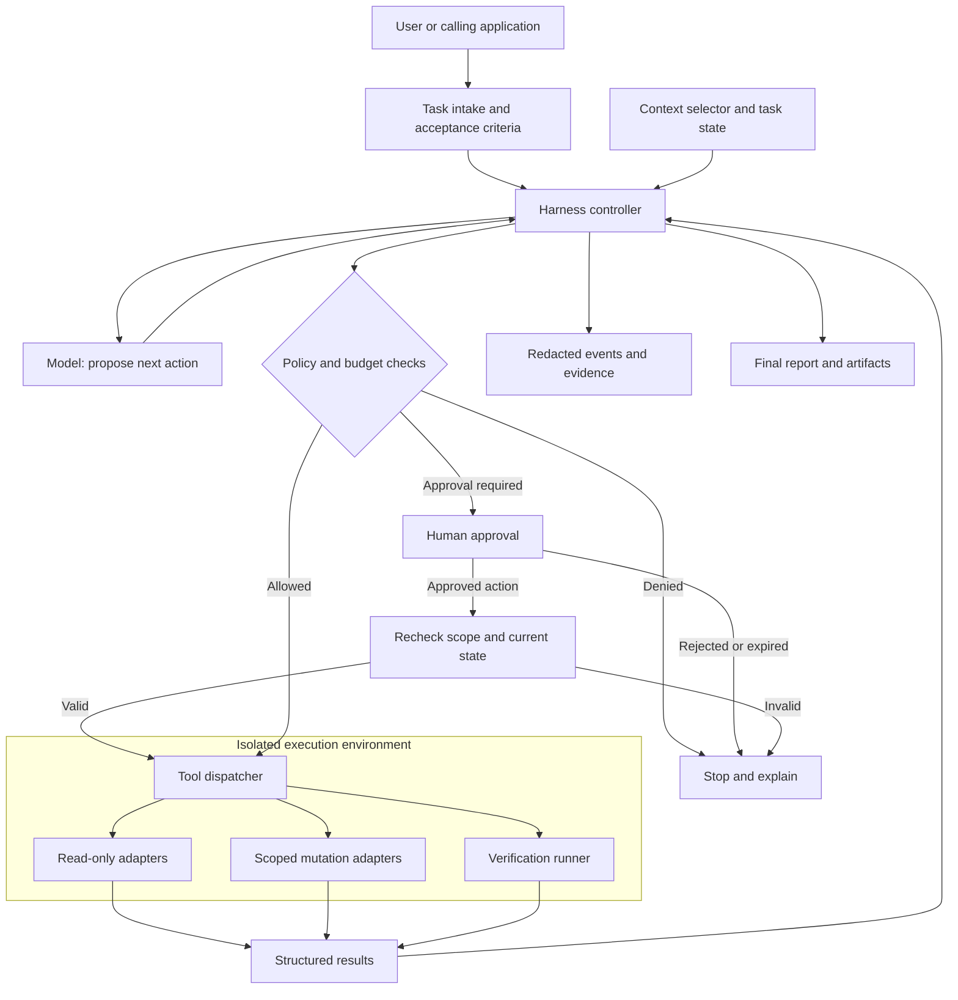

# Foundations

[Back to the guide](../README.md) · Next: [Execution](execution.md)

## Why use a harness?

A model can generate an answer, but production work usually requires more:

- understanding a request and the surrounding repository or service;
- choosing and invoking tools such as search, tests, or issue trackers;
- preserving user intent, permissions, and repository conventions;
- checking the result before reporting it; and
- leaving an auditable record of actions and decisions.

The harness owns these responsibilities. It should make the safe and correct
path easy, while keeping the agent's authority no broader than necessary.

For example, a model can suggest a bug fix. A harness can restrict the work to
one checkout, collect relevant code, apply a proposed patch, run tests in a
sandbox, and present the diff for review. The useful outcome is a verified
artifact, not merely a plausible response.

### Choose the simplest suitable approach

| Approach | Best fit | Boundary |
| --- | --- | --- |
| Direct model call | Summarizing supplied text or drafting an answer | The application still owns input handling and output validation. |
| Deterministic workflow | Known steps such as extract, validate, and route | Prefer ordinary code when the next action is predictable. |
| Agent with a harness | Tasks requiring adaptive search, tool selection, and iteration | Flexibility requires budgets, permissions, and independent verification. |
| Multiple agents | Work that genuinely benefits from independent specialists | Coordination, shared state, and verification become more complex. |

Retrieval-augmented generation (RAG) supplies relevant information; it does not
by itself authorize actions. A tool protocol such as the Model Context Protocol
(MCP) standardizes integration, but does not replace application policy,
identity checks, or runtime isolation.

## Core model

An effective harness separates the following concerns:

| Concern | Responsibility |
| --- | --- |
| **Task** | Defines the requested outcome, acceptance criteria, and constraints. |
| **Context** | Supplies only the repository, user, and execution information needed to do the work. |
| **Policy** | States non-negotiable safety, privacy, approval, and scope rules. |
| **Agent** | Reasons about the task and proposes or performs the next action. |
| **Tools** | Provide explicit, typed capabilities to inspect, change, validate, and publish work. |
| **Runtime** | Enforces isolation, timeouts, credentials, filesystem boundaries, and network controls. |
| **Verifier** | Evaluates the result using tests, linters, reviewers, or explicit acceptance checks. |
| **Reporter** | Communicates progress, evidence, limitations, and the final outcome. |

Keep these layers distinct. In particular, policy and tool permissions belong to
the harness rather than relying solely on instructions supplied to the model.

## Reference architecture

The model proposes actions; the harness decides whether and how they execute.
Keep credentials and enforcement outside the model's context.

The controller owns task state and scheduling. The dispatcher checks tool
identity, arguments, authorization, and limits on every invocation. The runtime
enforces filesystem, process, and network boundaries even if the model or a
tool behaves unexpectedly. External systems still require their own scoped
credentials and authorization; a sandbox alone cannot prevent misuse of a
permitted API.

For a first version, these can be modules in one service rather than separate
microservices. Separate the trust boundaries before separating deployments.
Store durable task state so a service restart does not silently lose approvals
or repeat consequential actions.

## Agent lifecycle

Use a bounded, observable lifecycle rather than an unstructured conversation:

1. **Receive** — parse the task, identify the target, and record the requested
   outcome.
2. **Orient** — inspect the relevant project instructions, status, code, and
   existing tests before changing anything.
3. **Plan** — turn the request into small, verifiable steps; surface ambiguity
   or required approval early.
4. **Act** — call the least-privileged tool needed for each step. Prefer
   inspection before mutation.
5. **Verify** — run the narrowest relevant checks, then manually review the
   changed behavior and diff.
6. **Report** — state what changed, how it was verified, and any remaining
   risks or follow-up work.

The harness should stop when the task is complete, when a policy boundary is
reached, or when continuing would require a decision from the user.

```mermaid
stateDiagram-v2
    [*] --> Received
    Received --> Orienting
    Orienting --> Planning
    Planning --> Acting: Clear scope
    Planning --> Waiting: Clarification needed
    Acting --> Waiting: Approval needed
    Waiting --> Planning: Clarified or approved; revalidate
    Waiting --> Stopped: Rejected or expired
    Acting --> Verifying: Candidate ready
    Verifying --> Acting: Repairable failure within budget
    Verifying --> Completed: Acceptance criteria met
    Verifying --> Stopped: Blocked or budget exhausted
    Acting --> Stopped: Denied, cancelled, or limit reached
    Completed --> [*]
    Stopped --> [*]
```

Cancellation and deadlines apply in every nonterminal state, including waiting
and verification. A stopped run may retain useful artifacts, but must not be
reported as completed. A verifier failure should lead to a bounded repair
attempt or a clear blocker, not an indefinite retry loop.

### Recovery and retries

- Retry transient read failures with bounded backoff; do not retry a policy
  denial or invalid argument unchanged.
- Before retrying a write after a timeout, query the destination for its outcome.
  A missing response does not mean the action failed.
- Use idempotency keys where the destination supports them. Otherwise,
  reconcile state or ask a human rather than blindly repeating a write.
- Checkpoint the current plan, artifact revision, completed tool calls, and
  pending approvals. Revalidate permissions and resource versions on resume.
- Do not assume external effects can be rolled back. Define a compensating
  action or manual recovery procedure for each consequential operation.
